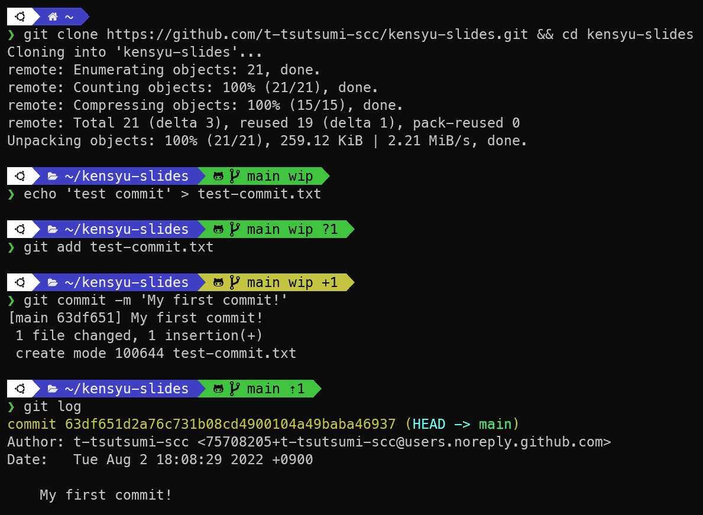

# バージョン管理システム活用入門（Git 編）

バージョン管理システムの基礎を座学で学ぶと共に、開発現場でGitを活用するために知っておくべき使い方をハンズオンで実践しましょう。

---

# タイムテーブル

09:00～09:40 【座学】バージョン管理とGitの基本
09:40～11:40 【ハンズオン】Gitの活用演習
11:40～12:00 【ディスカッション】バージョン管理の実践についての意見交換

---

# 研修用 Azure Virtual Desktop (AVD) への接続方法

## (1) Microsoft Store クライアント（ストアアプリ）

- https://apps.microsoft.com/store/detail/9WZDNCRFJ3PS
- ワークスペース接続先：
  https://rdweb.wvd.microsoft.com/api/arm/feeddiscovery

## (2) Web クライアント（ブラウザ）

- https://client.wvd.microsoft.com/arm/webclient/index.html

---

# Git Tutorial for Beginners: Learn Git in 1 Hour

https://youtu.be/8JJ101D3knE

---

# Gitの用語を覚えるのにおススメの参考文献

[【イラストで覚える】初心者のためのGitとGitHub用語集](https://zukulog098r.com/git/) ([:open_file_folder:図のみDL](https://zukulog098r.com/wp-content/uploads/2019/08/git-github-2.zip))

<blockquote class="twitter-tweet">
GitとGitHub用語について、改正してデジ絵にしました！ <a href="https://t.co/pGO2MaqEMs">pic.twitter.com/pGO2MaqEMs</a>
&mdash; ちづみ (@098ra0209) <a href="https://twitter.com/098ra0209/status/1163424568544907265?ref_src=twsrc%5Etfw">August 19, 2019</a></blockquote>

---

# Gitの概念や操作を覚えるのにおススメの参考文献

- ### [サル先生のGit入門](https://backlog.com/ja/git-tutorial/)
- ### [図解 Git](https://marklodato.github.io/visual-git-guide/index-ja.html)

---

# Gitリポジトリの操作方法

- Git GUI ソフトウェア
- IDE付属のバージョン管理機能
- コマンドライン（gitコマンド）

本研修では、Git GUI ソフトウェアの一つである**Sourcetree**を使用します。
（無料で制限なく商用利用が可能な唯一の選択肢）

また、マージを補助するツールとして**P4Merge**を任意で使用します。

---

# Git GUI ソフトウェアを使用するメリット

- gitコマンドによるCLI操作と比べて初心者に優しい
- IDE付属のバージョン管理機能よりも高機能でシームレスな操作が可能
  - 関心領域の違いからIDEのコード記述用ウィンドウレイアウトだとイマイチ
  - IDEでコードを開いたままGitの操作ができる（マルチディスプレイで◎）

---

# 最低限覚えたいGitの基本操作

1. リモートリポジトリをローカルリポジトリとして複製 (clone)
1. ローカルリポジトリにコードの変更を反映 (commit)
1. リモートリポジトリにローカルリポジトリの変更を反映 (push)
1. リモートリポジトリの変更を取得 (fetch)
1. リモートリポジトリの変更を取得して取り込み (pull)
1. ブランチの作成 (branch)
1. 作業ブランチの切替 (checkout/switch)

---

# Gitを活用するために知っておきたい応用操作

1. リモートリポジトリを別のリモートリポジトリに複製 (fork)
1. 対象ブランチの変更を作業ブランチに取り込み (merge)
1. 派生する変更やブランチ(枝)を接ぎ木(リベース)して1本にする (rebase)
1. 対象のコミットを作業ブランチに取り込む (cherry-pick)
1. 作業ツリーの変更(未コミット/未ステージ)を特別な領域に退避する (stash)
1. 作業ブランチのHEADを特定コミットに移動する (reset)
1. コンフリクト(変更の競合)の解消

---

# 参考文献を見ながら 基本操作と応用操作のイメージを掴む

- [【イラストで覚える】初心者のためのGitとGitHub用語集](https://zukulog098r.com/git/)
- [サル先生のGit入門](https://backlog.com/ja/git-tutorial/)

---

# ハンズオンでGitの操作を体験してみよう

研修で一時的に利用可能なリモートGitリポジトリとして、
セルフホスティングのGiteaを用意しました。

### URL：別途連絡

---

# 実践編

自分で調べながらやれる人は自分のペースでどんどん進めてください！
不安がある人は講師と一緒に取り組みましょう。

---

# 実践① 最低限覚えたいGitの基本操作

1. リモートリポジトリをローカルリポジトリとして複製 (clone)
1. ローカルリポジトリにコードの変更を反映 (commit)
1. リモートリポジトリにローカルリポジトリの変更を反映 (push)
1. リモートリポジトリの変更を取得 (fetch)
1. リモートリポジトリの変更を取得して取り込み (pull)
1. ブランチの作成 (branch)
1. 作業ブランチの切替 (checkout/switch)

---

# 実践② Gitを活用するために知っておきたい応用操作

1. リモートリポジトリを別のリモートリポジトリに複製 (fork)
1. 対象ブランチの変更を作業ブランチに取り込み (merge)
1. 派生する変更やブランチ(枝)を接ぎ木(リベース)して1本にする (rebase)
1. 対象のコミットを作業ブランチに取り込む (cherry-pick)
1. 作業ツリーの変更(未コミット/未ステージ)を特別な領域に退避する (stash)
1. 作業ブランチのHEADを特定コミットに移動する (reset)
1. コンフリクト(変更の競合)の解消

---

# 実践③ ミクシィグループの学生向け技術イベント 　　　　「git challenge」

余裕がある人はチュートリアル編をやってみましょう！
https://github.com/mixi-git-challenge/git-challenge-tutorial

---

# Tips紹介

- ステージからコミットまでの流れ
- フェッチとプルの使い分け
- リベースの使いどころ
- リスクのあるGit操作を行う際の注意点
- P4Mergeを使用した3-Wayマージ

---

# バージョン管理の実践についての意見交換

グループに分かれて意見交換してみましょう！

## トピック例

- 自部門、所属プロジェクトの取り組み
  Gitを活用してる！ / 活用はできてないけどGitを使用 / Subversionを使用 / そもそもバージョン管理してない:cry:
- 非開発業務でのバージョン管理システムの活用
- エンジニアとして技術に触れる機会の必要性（開発業務を担当していない場合）

---

# APPENDIX: 研修内で使用したツール

- [Atlassian Sourcetree](https://www.sourcetreeapp.com/)：GIT GUI ツール
- [Perforce P4Merge](https://www.perforce.com/ja/zhipin/helix-core-apps/merge-diff-tool-p4merge)：マージツール

