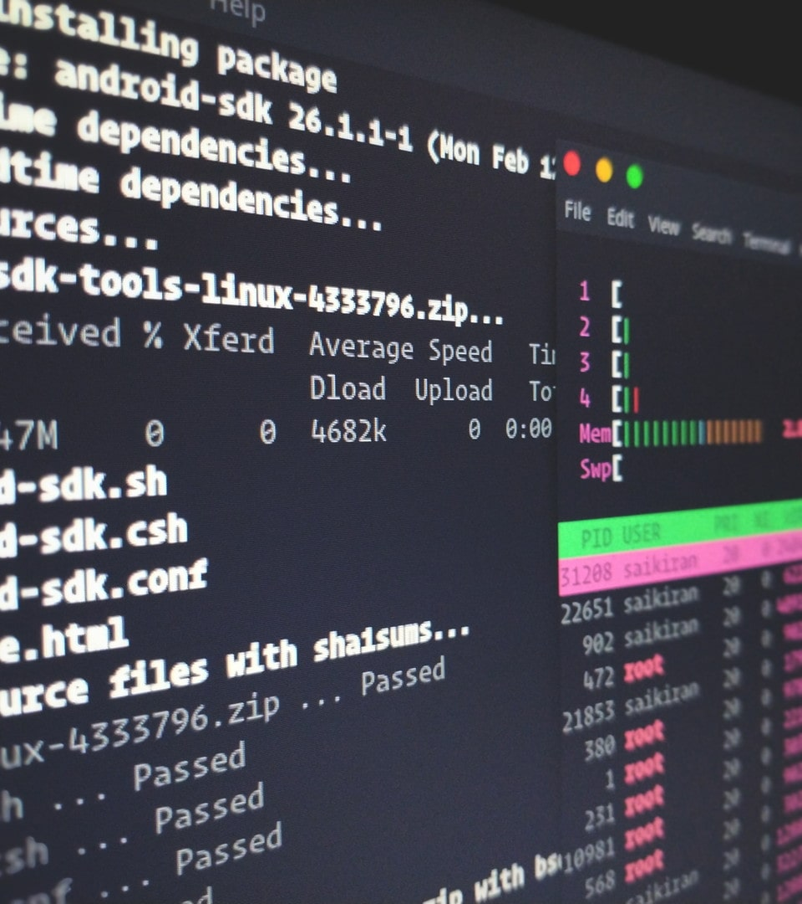

# Linux活用入門

Linuxの基礎を座学で学ぶと共に、基本的な操作をハンズオンで実践しましょう。



---

# 研修用 Azure Virtual Desktop (AVD) への接続

## AVD接続クライアント

### (1) Microsoft Store クライアント（ストアアプリ）

- https://apps.microsoft.com/store/detail/9WZDNCRFJ3PS
- ワークスペース接続先：
  https://rdweb.wvd.microsoft.com/api/arm/feeddiscovery

### (2) Web クライアント（ブラウザ）

- https://client.wvd.microsoft.com/arm/webclient/index.html

---

## AVD接続情報

- 受講者番号：3桁数字、001～
- ユーザID：画面共有にて伝達
- パスワード：画面共有にて伝達

## AVD初期セットアップ

1. AVDのクライアントと前頁のAVD接続情報を使用してログイン（数分かかる）
2. ログインできたら、Windowsのスタートメニューから「研修環境初期セットアップ」を起動（数分かかる）
3. 本資料を研修環境のブラウザで開く（接続元と研修環境でクリップボードは共有できるのでURLはコピペ）

---

# 学習の流れ

1. 開発現場での利用シーンを想定したモデルケースに沿って学習を行う（過去に実施した研修の内容）
2. 正規表現を活用して文字列置換・編集、ファイル検索などの操作を行う課題を解く

---

# Linuxとは

- UNIX系OSの1つであり多くのシステムに採用されている
- OSの中核となるプログラム群「カーネル」のライセンスはGPLでフリーかつオープンソース


---

# Linuxの利用シーン

- サーバOS：様々なシステムでシェア大
- ネットワーク機器：ルータ、スイッチ
- スマートフォン／タブレット：Android
- 家電：テレビ、HDDレコーダー、カーナビ

---

# Linuxディストリビューション

Linuxカーネル、ライブラリ、アプリケーションなどをまとめたパッケージ
サーバOS以外の用途ではディストリビューションを採用せず独自にカスタマイズして利用するケースが多い

#### 主なディストリビューション（サーバOS用途）

- Debian系：Debian, Ubuntu
- RedHat系：Red Hat Enterprise Linux, CentOS, Oracle Linux, Amazon Linux
- その他：SUSE Linux Enterprise Server

---

# Windows上でのLinuxの利用

Windows Subsystem for Linux (WSL) により、Windows上でもUbuntuのようなLinuxディストリビューションを動作させられるようになっており、ローカル開発環境として広く利用されている

---

# モデルケースによる学習の目的

Linuxの基本的な知識と操作を習得する。例えば...

- Linux上でファイルや文字列を検索、編集、置換
- プロセスやネットワーク状態の確認
- ログファイルや設定ファイルの検索

---

# モデルケースによる学習の流れ

1. サーバへログイン
2. アプリケーションの配置
3. 稼動確認
4. エラーログの抽出
5. 設定変更
6. ログの取得

---

# 1. サーバへログイン


---

# Linuxの起動

仮想化ソフトVirtualBoxを使用してインストール済のUbuntuを起動する

1. エクスプローラーで `C:\Kensyu\Linux\Ubuntu.ova` をダブルクリック
2. 仮想アプライアンスのインポートダイアログが表示されるので、そのまま「インポート」ボタンをクリック（数分かかる）
3. 研修環境のAzure VMのバグ対策で、研修環境のWindowsを再起動
4. インポートが完了したら、WindowsのスタートメニューからOracle VM VirtualBoxを起動し、インポートした「Ubuntu」をクリック、続けて「起動(T))ボタンをクリック（1分程度でLinuxが起動）

---

# Linuxへのログイン方法

- ローカルログイン
  リモート接続を設定する前やスタンドアロン環境のLinuxへログイン

- リモートログイン
  遠隔地やサーバルームなど別の場所で稼動しているLinuxへログイン
  CLIではSSH、GUIではVNC（WindowsではRDP）が広く利用されている

*本講座ではTeraTermを使用してSSHでLinuxへログインする*

---

# Tera Termとは

TelnetやSSHなどの接続方法に対応したターミナルソフトウェア

#### 使用前に覚えてほしいこと

- クリップボードへのコピーはTera Term上のテキストの範囲選択
  ※コピーのショートカットキーとしてよく使用される`Ctrl + c`はプロセスへの割込・中止が行われる
- クリップボードのペーストは右クリックまたは`Alt + v`
- メニューバーから『ファイル』⇒『ログ』で操作ログを記録

---

# 【演習】Linuxへのリモート接続

1. WindowsのスタートメニューからTera Termを起動
2. 接続情報を入力してOKボタンをクリック
   - TCP/IP（ラジオボタン）を選択
   - ホスト：127.0.0.1
   - サービス：SSH
   - SSHバージョン：SSH2
3. SSH認証情報を入力してOKボタンをクリック
   - ユーザ名：kensyu
   - パスワード：AVD接続情報のパスワードと同様
   - プレインテキストを使う（ラジオボタン）を選択

---

4. ログインが成功すると、`Welcome to Ubuntu`で始まるメッセージが表示され、`kensyu@linux-kensyu:~$ `の表示で入力待機状態となる
5. exitコマンドを実行してログアウトする（`exit`と入力してEnterキーで実行）

---

# 2. アプリケーションの配置


---

# ユーザとグループ

- ユーザ
  ユーザID（UID）で識別され、1つ以上のグループに所属する
  特権ユーザと非特権ユーザ（一般ユーザとも呼ばれる）の2種類がある
  - 特権ユーザ
    システム全体に対する権限を持つスーパーユーザ（多くのLinuxではroot）
    通常の操作では一般ユーザを使用し、権限が必要な場合のみの使用に留める

- グループ
  ユーザを論理的にまとめて扱うための単位

---

# ファイルの所有者と権限

- ファイルの所有者（オーナー：owner）
  所有者（ユーザ）と所有グループが存在し、通常はファイルを作成したユーザが所有者、ファイルを作成したユーザのプライマリグループが所有グループとなる

- ファイルの権限（パーミッション：permission）
  すべてのファイルは対象と権限の組み合わせによるパーミッションを持つ
  - 対象：所有者(**u**ser)、所有グループ(**g**roup)、その他のユーザ(**o**ther)
  - 権限：読み(**r**ead)、書き(**w**rite)、実行(e**x**ecute)

---

# ファイルとディレクトリの各権限が持つ意味

#### ファイル

- `r`：ファイルを読み取る権限
- `w`：ファイルに書き込む権限
- `x`：ファイルを実行する権限

#### ディレクトリ

- `r`：ディレクトリ内のファイルを読み取る権限
- `w`：ディレクトリ内のファイルに書き込む権限
- `x`：サブディレクトリへのアクセスを実行する権限

---

# パーミッションの表現方法

対象と権限の組み合わせを、8進数の数字3文字または`rwx-`の組み合わせ9文字の文字列で表現する

#### 8進数の数字3桁表現

対象：1文字目が所有者、2文字目が所有グループ、3文字目がその他のユーザの権限
権限：保有権限に応じて、読み(r)は4、書き(w)は2、実行(x)は1を加算した数値で表現

`750`の場合、所有者は読み・書き・実行が可能、所有グループは読みと実行が可能、その他のユーザは権限を持たないことを指す

---

#### 9文字の文字列表現

対象：1～3文字目が所有者、4～6が所有グループ、7～9がその他のユーザの権限
権限：読み込み可能は1桁目に`r`、書き込み可能は2桁目に`w`、実行可能は3桁目に`x`の文字列で表現（権限なしは`-`）

`rwxr-x---`の場合、所有者は読み・書き・実行が可能、所有グループは読みと実行が可能、その他のユーザは権限を持たないことを指す

---

# Linuxで頻繁に使用する基本ディレクトリ (1)

| パス   | 説明   |
| ------ | ------ |
| /      | ルートディレクトリと呼ばれる最上位のディレクトリ |
| /usr   | インストールされたソフトウェア、共有ライブラリなど |
| /etc   | システム固有の設定ファイル |
| /var   | システム固有のデータファイル（データベース、キャッシュ、ログなど） |

---

# Linuxで頻繁に使用する基本ディレクトリ (2)

| パス   | 説明   |
| ------ | ------ |
| /home  | 一般ユーザが個人データと設定ファイルを格納するホームディレクトリ※の親ディレクトリ |
| /root  | 特権ユーザであるrootのホームディレクトリ |
| /tmp   | 全てのユーザが書き込み可能な一時ファイル用のディレクトリ |

※`kensyu`ユーザの場合は`/home/kensyu`がホームディレクトリ (短縮表現: `~`)

---

# シェル

OSとユーザの間を仲介してくれるプログラムで、ユーザが入力したコマンドを翻訳してOSに渡す
シェルの種類によって使用できるコマンドが異なる

#### 主なシェル

- bash：広く一般的に使用されているシェル
- zsh：ローカル開発環境などで使用されている高機能なシェル
- dash：POSIX互換の低機能・高速なシェル（Debian系の`/bin/sh`）

---

# コマンド

コマンド名の後に半角スペースを空けて引数（半角スペース区切りで複数可）を並べる構成になっている

`ls`コマンドを2つの引数`-l`と`/home/kensyu`で実行する例：

```bash
ls -l /home/kensyu
```

---

# プロンプト

CUIにおいて「コマンド入力待ち状態であることを表す記号」を指しており、Linuxでは主に`$`（一般ユーザ用）と`#`（特権ユーザ用）が用いられる

`linux-kensyu`ホストの一般ユーザ`kensyu`でログインしており、作業ディレクトリが`/home`であることを示すプロンプト：

```bash
[kensyu@linux-kensyu /home]$
```

---

# リダイレクト

デフォルトの標準入力はキーボード、標準出力・標準エラー出力は画面(ターミナル)だが、リダイレクトを使用することで向きを変更することが可能

`コマンド < ファイル`：コマンドの標準入力をファイルにする
`コマンド > ファイル`：コマンドの標準出力をファイルに向ける（上書き形式）
`コマンド >> ファイル`：コマンドの標準出力をファイルに向ける（追記形式）
`コマンド 2> ファイル`：コマンドの標準エラー出力をファイルに向ける（上書き形式）
`コマンド > ファイル 2>&1`：コマンドの標準エラー出力を標準出力に統合し、標準出力をファイルに向ける（上書き形式）

---

# パイプ

コマンドは`|`(パイプ)を使用して連結して、前のコマンドの標準出力（標準エラー出力は含まれない）を次のコマンドの標準入力として渡すことが可能

```bash
echo "OK NG\n0 1" | column -t
```

---

# bashにおける記号の扱い

- `'`(シングルクォート)で囲まれた範囲は文字列として扱う
- `"`(ダブルクォート)で囲まれた範囲は文字列として扱う（変数展開有）
- `` ` ``(バッククォート)で囲まれた範囲はクォート内のコマンドの標準出力に置換
  `$(コマンド)`も`` `コマンド` ``とほぼ同じ意味

```
$ test=date                      # 準備1：変数 test に文字列 date を格納
$ echo '$test'                   # 入力1：シングルクォート
$test                            # 出力1：$付きの変数名がそのまま表示される
$ echo "$test"                   # 入力1：ダブルクォート
date                             # 出力2：変数を展開して表示
$ echo `date`                    # 入力3：バッククォート
Tue Mar 8 18:01:34 JST 2016      # 出力3：dateコマンドの実行結果が表示される
```

---

# コマンドのヘルプ

- helpオプションによるヘルプの入手
  多くのコマンドはオプションに`--help`をつけることでヘルプが表示できる

- manによるヘルプの入手
  `man コマンド名`でコマンドの詳細な説明を表示できる

```bash
ls --help   # lsコマンドのhelpを表示
man ls      # lsコマンドのmanを表示
```

---

# 特権でのコマンドの実行 (sudo)

ログインユーザとは別の権限レベル（一般的にはroot）でコマンドを実行する
sudoで実行したコマンドは`/var/log/auth.log`に記録される

```
$ ls -a /root
ls: cannot open directory '/root': Permission denied

$ sudo ls -a /root
.  ..  .bash_history  .bashrc  .profile  .viminfo
```

---

# アプリケーションの配置手順

1. アプリケーションをサーバに転送する
2. アプリケーションを既定のディレクトリへ移動する

※アプリケーションは配布形式になっている前提（war, jar など）

---

# 【演習】アプリケーションの配置 (1)

サンプルアプリをWinSCPを利用してサーバ上に転送する

1. WinSCPを起動
2. 接続情報を入力しサーバに接続（接続情報はTera Termのログイン時と同様）
3. WinSCPの画面左側のエリアで`C:\Kensyu\Linux`へ移動
4. example.warを選択し、右クリックメニューからアップロードを選択
5. サブウインドウで送信先が「/home/kensyu/*.*」になっていることを確認
6. 送信先が5.の通りになっていたら「OK」ボタンを押下


---

# 【演習】アプリケーションの配置 (2)

Tomcatへのアプリケーションの配置

1. Tera Termを起動し、サーバに接続
2. lsコマンドでexample.warが転送できていることを確認
   ```bash
   ls -la
   ```
3. mvコマンドでTomcatのwebappディレクトリにexample.warを配置
   ```bash
   sudo mv -i example.war /var/lib/tomcat9/webapps/
   ```
4. chownコマンドでexample.warの所有者をtomcatに変更
   ```bash
   sudo chown tomcat: /var/lib/tomcat9/webapps/example.war
   ```

---

5. Tomcatを再起動
   ```bash
   sudo systemctl restart tomcat9
   ```

6. 研修環境のブラウザで http://127.0.0.1:8080/example/Top にアクセスして画面が表示されることを確認

---

# 3. 稼動確認


---

# 確認観点

#### プロセスの稼動状態

- プロセスが正常に稼動しているか

#### ネットワーク通信

- ネットワーク通信が正常に行えているか
- 指定したポートがListen状態になっているか

#### ログ出力

- アプリケーションやミドルウェアは指定のファイルにログを出力しているか
- 出力されたログにエラーや警告はないか

---

# プロセス

#### プロセス

Linux上で動作するプログラムのこと
プロセスは「親子関係」と「状態」を持つ

#### デーモン

バックグラウンドで待機または稼動するプロセスのこと
悪魔（demon）ではなく守護神（daemon）の意

#### サービス

OS起動時に自動的に起動するように設定されたデーモンのこと
多くの場合、1つ以上のデーモンを表す

---

# プロセスの確認

#### ps

現在のプロセスの一覧表示を行う

```bash
ps aux           # 全プロセスの一覧表示
ps u -U kensyu   # プロセスを起動したユーザ指定で表示
```

#### lsof

プロセスが開いているファイルを表示する

```bash
sudo lsof -i :22       # ポート番号指定
sudo lsof -u kensyu    # ユーザ指定
sudo lsof -p <PID>     # プロセスID指定
```

---

# ネットワークの確認

#### ss (netstat)

ネットワーク接続、経路テーブル、インターフェースの状態などを表示する

```bash
ss -nlte                 # TCPでListenしているソケットを表示
ss -nlte sport 22        # TCPポート22番でListenしているソケットを表示
sudo ss -nltpe sport 22  # TCPポート22番でListenしているソケット・プロセスを表示
```

#### ping

ICMP Echo Requestパケットを送信

```bash
ping google.com
```

---

#### traceroute

特定のIPアドレス、ホストへの通信経路を表示する

```bash
sudo traceroute -nI google.com
```

---

# 【演習】Tomcatの稼動状態を確認

プロセスとネットワークの状態を確認する

1. Tera Termでサーバにログインする
2. psコマンドでtomcatのプロセスが稼動しているか確認する
   ```bash
   ps u -U tomcat
   ```
3. ssコマンドでtomcatが8080ポートをListenしているか確認する
   ```bash
   ss -nlt sport = 8080
   ```
4. lsofコマンドでtomcatのプロセスが開いているファイルを確認する
   ```bash
   sudo -u tomcat lsof -p <TomcatのPID>
   ```

---

# ログの種類

#### systemd journal

Linuxのシステム管理機構であるsystemd標準のログ形式（ジャーナル）
バイナリ形式のためテキストとして直接見ることはできないが、圧縮や世代管理などの機能が標準で備わっている

#### syslog

systemd登場以前から存在するレガシーなログ記録・転送機構
`/var/log`ディレクトリ配下にログファイルを保存する
互換性のためにsystemd journalがsyslogにログを転送していることが多い

#### アプリケーションログ

アプリケーション固有のログであり、出力先も作り次第

---

# ログの確認

#### tail

ファイルの末尾を表示するコマンド
`-n` N オプションで表示する行を指定できる（デフォルトは10行）
`-f` オプションでファイルを常に監視し、表示を更新する

```bash
tail -f /var/log/syslog
```

#### view

viエディタを読み取り専用モードで使用するコマンド

```bash
view /home/kensyu/sample.txt
```

---

#### journalctl

systemdのジャーナルを参照するコマンド
`-u` オプションでUnit（サービス）を指定して表示
`-f` オプションで`tail -f`と同様にリアルタイム表示
`-S`と`-U`オプションで指定期間のログを抽出

```bash
journalctl -fu tomcat9              # tomcat9のログをtailモードで表示
journalctl -S 2022-08-01 -U -1h30m  # 2022年8月1日から1時間半前までのログを表示
```

---

# 【演習】Tomcatのログを確認

Tomcatが出力するログを確認する

1. Tera Termでサーバにログインする
2. tailコマンドでTomcatのログファイルの最終行から100行を確認する
   ```bash
   tail -100 /var/log/tomcat9/catalina.$(date +%F).log
   ```
3. journalctlコマンドでシステムに記録されたTomcatのログを表示する
   ```bash
   journalctl -u tomcat9
   ```

---

# 4. エラーログの抽出


---

# ファイル操作の基本

#### ファイルの検索

- ファイル名でファイルを検索する
- ファイル内のテキストを検索する

#### ファイルの作成、編集

- ファイルを新規に作成する
- ファイルを編集し、テキストの追加、削除を行う

#### ファイルの削除

---

# ファイルの検索

#### find

ディレクトリ階層をたどって、条件を満たすファイルを検索する
`find <ディレクトリ> [検索条件]`

```bash
find . -name 'sample*'
```

Tips：出力順がバラバラのため、並び替えが必要な場合は`sort`コマンドにパイプする

---

#### grep

正規表現を利用して一致するデータを取り出す
`grep <正規表現パターン> [ファイル]`

```bash
grep dog sample.txt
```

---

# findとgrepの組み合わせによる検索

findの`-exec`オプションでマッチしたファイルに対して任意のコマンドを実行する

```bash
find . -type f -exec grep -Hn dog '{}' \;
```

# xargsコマンドの活用

可変長引数に対応したコマンドを実行する場合はxargsコマンドが利用できる

```bash
find . -type f | xargs grep -Hn dog
```

---

# 【演習】エラーログを抽出する

tomcatのログからエラーメッセージを抽出する

1. grepコマンドでtomcatのログにエラーが出力されていないか確認
   ```bash
   sudo grep -i error /var/log/tomcat9/catalina.$(date +%F).log
   ```
2. /var/log/tomcat9配下のファイルにエラーが出力されていないか確認
   ```bash
   sudo find /var/log/tomcat9 -type f | xargs grep -Hni error
   ```
3. 出力されているエラー内容から原因を特定する

---

# 5. 設定変更


---

# ファイルのコピー、移動、削除

#### cp

ファイルをコピーする
`-p`オプションを指定しない場合、コピー先のファイル所有者は実行ユーザとなる

```bash
cp -i ./sample.txt ./sample.txt.org
```

#### mv

ファイルを移動する
移動するファイルの所有者、権限は変更されない

```bash
mv -i ./sample.txt ./sample-new.txt
```

---

#### rm

ファイルを削除する

```bash
rm -i ./sample-new.txt
```

**【重要】ファイルを変更、削除するコマンドは原則`-i`オプションを指定すること！**

---

# エディタによるファイルの編集

vi（vim）やnanoエディタを使用してファイルを編集する

```bash
vi ./sample.txt
nano ./sample.txt
```

viは操作が独特で覚えることが多いため、未経験者はnanoを推奨
どちらもほぼすべてのディストリビューションにプレインストールされている

---

# sedによるテキスト操作

テキストのフィルタリング、変換用のストリームエディタ
文字列の置換、抽出、削除などを行う際に幅広く利用されている

```bash
# sample.txt内のcatという文字列をbirdという文字列に置換して標準出力に出力する例
sed 's/cat/bird/g' ./sample.txt
```

---

# awkによるテキスト操作

テキスト処理に長けたスクリプト言語
条件分岐や繰り返し、四則演算なども利用できる

```bash
# sample.txt内を1行ずつ走査し、catで終わる行があれば標準出力に出力する例
awk '/cat$/ {print $0}' ./sample.txt
```

---

# 【演習】ファイルを編集する

Webアプリケーションで読み込むファイルのファイル名、内容を変更する

1. ユーザをrootに切り替える
   ```bash
   sudo -i
   ```
2. ディレクトリを変更
   ```bash
   cd /var/lib/tomcat9/webapps/example/data
   ```
3. cpコマンドでバックアップを作成
   ```bash
   cp -ip data.csv data.csv.org
   ```

---

4. mvコマンドでファイル名を変更
   ```bash
   mv -i data.csv Data.csv
   ```
5. エディタでファイルを編集
   ```bash
   nano Data.csv
   ```
6. 研修環境のブラウザで http://127.0.0.1:8080/example/Top へアクセス

---

# 6. ログの取得


---

# ファイルのアーカイブ

#### tar

tarアーカイブの作成、解凍を行う

```bash
tar -cvzf sample.tar.gz sample.txt sample2.txt  # 作成
tar -tvzf sample.tar.gz                         # アーカイブ内容の確認
tar -xvzf sample.tar.gz                         # 解凍
```

#### zip/unzip

ファイルやディレクトリをzip形式で圧縮、解凍する

```bash
zip sample.zip sample-2.txt sample-3.txt        # 作成
unzip sample.zip                                # 解凍
```

---

# 【演習】ログをアーカイブし取得する

複数のログをディレクトリにコピーし、作業ログとして取得する

1. 作業ログを格納するためのディレクトリを作成する
   ```bash
   mkdir $(date +%F)
   ```
2. ログを作成したディレクトリへコピーする
   ```bash
   sudo cp -ip /var/log/tomcat9/localhost.$(date +%F).log ./$(date +%F)
   cp -ip ./.bash_history ./$(date +%F)
   ```
3. 作業ディレクトリをアーカイブする
   ```bash
   zip -r $(date +%F).zip $(date +%F)
   ```
4. WinSCPを利用して作成したアーカイブを取得する

---

# 【演習】ログの集計をしてみよう！

## Tomcatのアクセスログを集計し標準出力へ出力する

HTTPのレスポンスコードごとにログを集計し、降順に標準出力へ出力
ヒント：find, awk, sort, uniq

#### Tomcatのアクセスログの書式

```
10.0.2.2 - - [29/Feb/2016:15:12:00 +0900] "GET /tomcat.css HTTP/1.1" 200 5576
```

※左から、リモートホスト名（あるいはIP）、リモート論理名（常に-）、認証されたリモートユーザ名、アクセス日時、リクエストメソッドとURL、HTTPレスポンスコード、レスポンスサイズ（byte）の順

---

<!-- _class: center -->

# モデルケースに沿った学習は以上

---

# 正規表現を活用して文字列置換・編集、ファイル検索などの操作を行う課題

事前準備：[CSVデータ](https://t-tsutsumi-scc.github.io/kensyu-slides/assets/data/linux-101/customer.csv)をダウンロードして手元に用意しておく


---

# 設問1

顧客データ（customer.csv）から、ステータスコードの末尾が数字の1〜9で終わるデータを全項目抽出し、先頭10件を出力する。

想定結果：
```
顧客ID          名前           性別コード  性別  生年月日    年齢  郵便番号  住所                                    会 員申込店舗コード  会員申込日  ステータスコード
CS001215000145  田崎 美紀      1           女性  1995-03-29  24    144-0055  東京都大田区仲六郷**********            S13001              20170605    6-20090929-2
CS033513000180  安斎 遥        1           女性  1962-07-11  56    241-0823  神奈川県横浜市旭区善部町**********      S14033              20150728    6-20080506-5
CS011215000048  芦田 沙耶      1           女性  1992-02-01  27    223-0062  神奈川県横浜市港北区日吉本町**********  S14011              20150228    C-20100421-9
CS040412000191  川井 郁恵      1           女性  1977-01-05  42    226-0021  神奈川県横浜市緑区北八朔町**********    S14040              20151101    1-20091025-4
CS009315000023  皆川 文世      1           女性  1980-04-15  38    154-0012  東京都世田谷区駒沢**********            S13009              20150319    5-20080322-1
CS015315000033  福士 璃奈子    1           女性  1983-03-17  36    135-0043  東京都江東区塩浜**********              S13015              20141024    4-20080219-3
CS023513000066  神戸 そら      1           女性  1961-12-17  57    210-0005  神奈川県川崎市川崎区東田町**********    S14023              20150915    5-20100524-9
CS035513000134  市川 美帆      1           女性  1960-03-27  59    156-0053  東京都世田谷区桜**********              S13035              20150227    8-20100711-9
CS001515000263  高松 夏空      1           女性  1962-11-09  56    144-0051  東京都大田区西蒲田**********            S13001              20160812    1-20100804-1
CS040314000027  鶴田 きみまろ  9           不明  1986-03-26  33    226-0027  神奈川県横浜市緑区長津田**********      S14040              20150122    2-20080426-4
```
---

# 設問2

顧客データ（customer.csv）から、ステータスコードの先頭がアルファベットのA〜Fで始まるデータを全項目抽出し、先頭10件を出力する。

想定結果：
```
顧客ID          名前           性別コード  性別  生年月日    年齢  郵便番号  住所                                    会 員申込店舗コード  会員申込日  ステータスコード
CS031415000172  宇多田 貴美子  1           女性  1976-10-04  42    151-0053  東京都渋谷区代々木**********            S13031              20150529    D-20100325-C
CS015414000103  奥野 陽子      1           女性  1977-08-09  41    136-0073  東京都江東区北砂**********              S13015              20150722    B-20100609-B
CS011215000048  芦田 沙耶      1           女性  1992-02-01  27    223-0062  神奈川県横浜市港北区日吉本町**********  S14011              20150228    C-20100421-9
CS029415000023  梅田 里穂      1           女性  1976-01-17  43    279-0043  千葉県浦安市富士見**********            S12029              20150610    D-20100918-E
CS035415000029  寺沢 真希      9           不明  1977-09-27  41    158-0096  東京都世田谷区玉川台**********          S13035              20141220    F-20101029-F
CS031415000106  宇野 由美子    1           女性  1970-02-26  49    151-0053  東京都渋谷区代々木**********            S13031              20150201    F-20100511-E
CS029215000025  石倉 美帆      1           女性  1993-09-28  25    279-0022  千葉県浦安市今川**********              S12029              20150708    B-20100820-C
CS033605000005  猪股 雄太      0           男性  1955-12-05  63    246-0031  神奈川県横浜市瀬谷区瀬谷**********      S14033              20150425    F-20100917-E
CS033415000229  板垣 菜々美    1           女性  1977-11-07  41    246-0021  神奈川県横浜市瀬谷区二ツ橋町**********  S14033              20150712    F-20100326-E
CS008415000145  黒谷 麻緒      1           女性  1977-06-27  41    157-0067  東京都世田谷区喜多見**********          S13008              20150829    F-20100622-F
```

---

# 設問3

顧客データ（customer.csv）から、ステータスコードの先頭がアルファベットのA〜Fで始まり、末尾が数字の1〜9で終わるデータを全項目抽出し、先頭10件を出力する。

想定結果：
```
顧客ID          名前         性別コード  性別  生年月日    年齢  郵便番号  住所                                    会員 申込店舗コード  会員申込日  ステータスコード
CS011215000048  芦田 沙耶    1           女性  1992-02-01  27    223-0062  神奈川県横浜市港北区日吉本町**********  S14011              20150228    C-20100421-9
CS022513000105  島村 貴美子  1           女性  1962-03-12  57    249-0002  神奈川県逗子市山の根**********          S14022              20150320    A-20091115-7
CS001515000096  水野 陽子    9           不明  1960-11-29  58    144-0053  東京都大田区蒲田本町**********          S13001              20150614    A-20100724-7
CS013615000053  西脇 季衣    1           女性  1953-10-18  65    261-0026  千葉県千葉市美浜区幕張西**********      S12013              20150128    B-20100329-6
CS020412000161  小宮 薫      1           女性  1974-05-21  44    174-0042  東京都板橋区東坂下**********            S13020              20150822    B-20081021-3
CS001215000097  竹中 あさみ  1           女性  1990-07-25  28    146-0095  東京都大田区多摩川**********            S13001              20170315    A-20100211-2
CS035212000007  内村 恵梨香  1           女性  1990-12-04  28    152-0023  東京都目黒区八雲**********              S13035              20151013    B-20101018-6
CS002515000386  野田 コウ    1           女性  1963-05-30  55    185-0013  東京都国分寺市西恋ケ窪**********        S13002              20160410    C-20100127-8
CS001615000372  稲垣 寿々花  1           女性  1956-10-29  62    144-0035  東京都大田区南蒲田**********            S13001              20170403    A-20100104-1
CS032512000121  松井 知世    1           女性  1962-09-04  56    210-0011  神奈川県川崎市川崎区富士見**********    S13032              20150727    A-20100103-5
```

---

# 設問4

顧客データ（customer.csv）から、7月または8月生まれで名に夏が含まれる会員を生年月日の昇順にソートし、先頭10件を出力する。

想定結果：
```
顧客ID          名前         性別コード  性別  生年月日    年齢  郵便番号  住所                                    会員 申込店舗コード  会員申込日  ステータスコード
CS002812000060  大谷 千夏    1           女性  1930-08-15  88    187-0043  東京都小平市学園東町**********          S13002               20180423    0-00000000-0
CS030715000037  柴田 千夏    1           女性  1939-07-03  79    272-0022  千葉県市川市鬼越**********              S12030               20141130    0-00000000-0
CS003712000030  斉藤 夏希    1           女性  1939-07-06  79    214-0014  神奈川県川崎市多摩区登戸**********      S13003               20150430    0-00000000-0
CS038715000020  竹村 夏空    1           女性  1939-08-17  79    134-0085  東京都江戸川区南葛西**********          S13038               20150709    0-00000000-0
CS031713000010  宇野 千夏    9           不明  1940-07-28  78    151-0061  東京都渋谷区初台**********              S13031               20150617    0-00000000-0
CS015713000080  牧 夏希      1           女性  1941-07-03  77    135-0042  東京都江東区木場**********              S13015               20151122    0-00000000-0
CS019715000013  船橋 千夏    1           女性  1942-08-13  76    171-0044  東京都豊島区千早**********              S13019               20150509    0-00000000-0
CS031715000048  奥村 千夏    1           女性  1942-08-19  76    151-0072  東京都渋谷区幡ヶ谷**********            S13031               20150606    0-00000000-0
CS002714000085  奈良 千夏    1           女性  1943-07-13  75    184-0015  東京都小金井市貫井北町**********        S13002               20180104    0-00000000-0
CS001712000151  石川 夏希    1           女性  1945-08-01  73    210-0003  神奈川県川崎市川崎区堀之内町**********  S13001               20170802    0-00000000-0
```

---

# 設問5

顧客データ（customer.csv）から、都道府県ごとの会員数を出力する。

想定結果：
```
      1 京都府
      1 北海道
      1 大阪府
     55 埼玉県
   2346 千葉県
   7640 神奈川県
  11927 東京都
```
